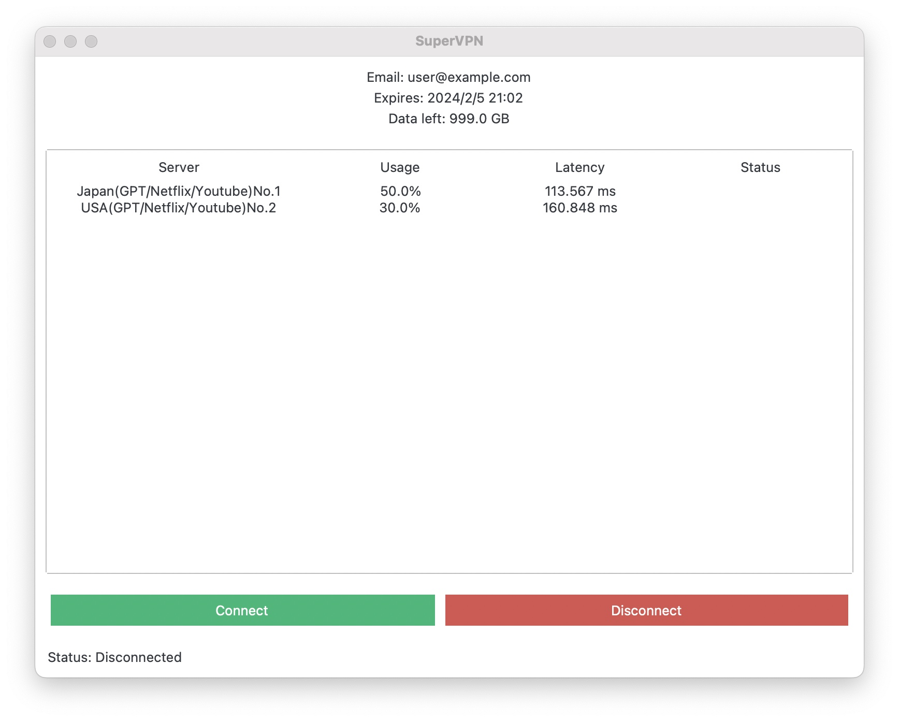

**环境**
使用MacOS开发和运行，理论可以在所有Linux和类unix系统上运行。
<p align="center">
     <br />
</p>

**构建程序**
在不同系统运行时需要重新make：
```shell
cmake .
make
```
make之后会生成如下名称的文件，这就是Python调用的动态链接库，要确保和main.py在同一路径下。
```
supervpn.cpython-38-darwin.so
```
**引用supervpn包**
在GUI中调用VPN实现函数所在的库：
```python
import supervpn
```
调用run函数：
```python
supervpn.run(args)
```
args为字符串数组，第一个变量为空，“”。执行run函数时传入以下参数就会尝试建立连接。
```python
args=["","client", "vpn.key", "170.106.178.152", "1959"]
```
**脚本文件与启动方式**
需要确保有Python环境并安装了相关库。
SuperVPN.scpt为苹果脚本文件，用于快捷启动，需要使用时只需修改路径和虚拟环境即可。
如果使用terminal手动启动：
```
sudo python main.py
```
如果使用命令行单独调用VPN，需要修改cmake和make条件，生成exec可执行文件，之后执行以下命令：
```
sudo supervpn client 'path/to/your/vpn.key' 'your_server_ip' 'port'
```
